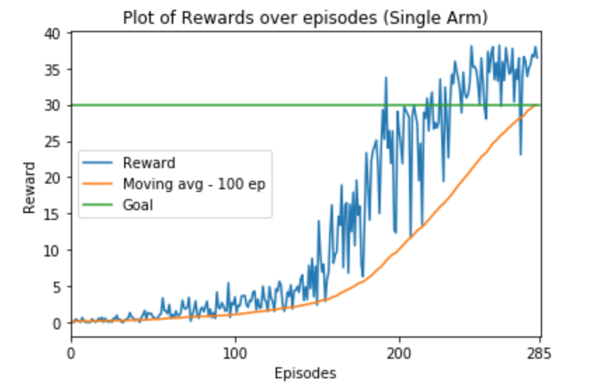

# Project Continuous Control Report

## Description

The goal of this project is to train an agent to control a doubly jointed arm move to (moving)target locations. The agent recieves a vector of observations (33 features), indicating the position, rotation, velocity and angular velocities of the arm. The agent has to decide how much torque needs to be applied to the two joints. The action space is continuous and is a vector of 4 numbers, each between -1 and 1. The agent gets a reward of +0.1 for each step that the agent's hand is in the target location. The goal is to maintain the position at the target location for as many time steps ad possible to maximize the reward. The project has a single agent version and another version with 20 identical agents, each with it's own copy of the environment.

For the single agent version, the agent must get an average score of +30 over 100 consecutive episodes for solving the environment. For the multiagent version, the agent must get an average score of +30 (over 100 consecutive episodes, and over all agents). 

## Algorithm

I use Deep Deterministic Policy Gradient (Actor-Critic) algorithm to train the agent. This is used to train agents to perform actions in continuous spaces. The actor network predicts the action to be taken by looking at the current state. It has a tanh activation at the output layer (since action space is continuous and in the range -1 to 1). The critic network decides the value of the state-action pair (using Bellman equation). The descriptions of the Actor and Critic network are described below:

**Actor:**

- Input Layer    : 33 features
- Hidden Layer 1 : 128 neurons
- Hidden Layer 2 : 64 neurons
- Hidden Layer 3 : 32 neurons
- Output Layer   : 4 neurons (tanh activation) representing 4 continuous values of torques to be applied.

**Critic**

- Input Layer    : 33 features
- If Single Arm: 
	Concat Layer : (33 from previous layer + 4 from output layer of Actor Network)
- Hidden Layer 1 : 128 neurons
- If Multi Arm: 
	Concat Layer : (128 from previous layer + 4 from output layer of Actor Network)
- Hidden Layer 2 : 64 neurons
- Hidden Layer 3 : 32 neurons
- Output Layer   : 1 (Representing the value of state action pair)

Both Actor and critic networks were trained using Adam Optimizer with an initial learning rate of 0.001 for a maximum of 1000 epochs. Replay buffer with a size of 50000 was used. The model was trained to explore during initial phase of training with epsilon set to 1 and gradually decaying it by 0.5% every epoch until it decayed upto 0.01 and then keping it fixed. The decay was introduced to account into the factor that the model learns to perform better as training progresses, and we can rely on recent observations. I also added Ornstein-Uhlenbeck noise with parameters(theta=0.15 and sigma=0.2) to aid in exploration. The OU noise is temporally correlated and is found to be useful over random noise for control tasks.

For multi arm task, I use a single agent trained using actor-critic algorithm as described above. I treat the state-action-observations of each of the 20 arms as 20 independent observations of a single agent and store in replay memory. The training procedure is same as described above, with same hyperparameter values. 

## Results

The above graph is for single arm reacher task. We can see (in the graph) that during the initial process of exploration, the model is learning slowly and getting less rewards at the begining. After a certain stage(around 150 epochs), when the model starts to exploit, the moving average of rewards shoots up. The model is able to acheive the goal(moving average of 30) in 285 episodes. 

The above graph is for multi arm reacher task. I used similar network architecture, except that the action input for multiarm task for critic network was given after 1st hidden layer (hence the number of trainable parameters were slightly lower compared to single arm task). The hyperparameters were exactly the same as previous task. The network was able to acheive an average score over all agents averaged in 267 episodes. Emperically, I observed that if I had used the same configuration for the network architecture as in single arm task, where the action input was concatinated with state vector at input layer, the training starts smoothly and it gets gradual increase in rewards at the beginning but after a few epochs the rewards drop drastically and network diverges. The reason for this divergence is not known and needs to be explored.   

If we look at the two graphs, we would notice that the rewards for the multiarm task are consistently higher especially at the begining of training. My assumption is that this could be because at each stage, instead of 1 observation (as in case of single arm), we have 20 observations (in multi arm). So, as learning progresses, when we randomly sample from the replay buffer, the chances of getting more samples from recent observations is higher i.e. the replay buffer fills 20 times faster with recent observations.

## Future Work

As described in the results section, I would like to explore why the multiarm reacher had the unusual divergent behavior when we concatinated the state and actions as input to critic network. I would also like to do hyperparam search and see if we could reach the goal faster and with smaller network sizes. 